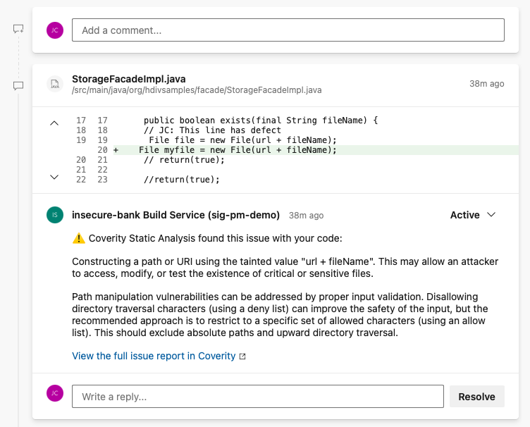

# Synopsys Azure DevOps Templates

Modern applications are a complex mix of proprietary and open source code, APIs and user interfaces, application behavior, and deployment workflows. Security issues at any point in this software supply chain can leave you and your customers  at risk. Synopsys solutions help you identify and manage software supply chain risks end-to-end.

The Synopsys Azure DevOps Templates repository contains Azure Pipelines .yml templates that allow you to integrate Synopsys AST soltuions into your Azure DevOps pipeline. Combined with a series of Python scripts, the following workflows can be accomplished:

1. Execute Coverity or Polaris from an Azure DevOps Pipeline
2. Optionally execute incremental analysis on pull requests in order to optimize velocity
3. Annotate Azure Repos Pull Requests with security testing findings so they can be resolved before merge
4. Prevent merging of a pull request if security policy is not met
5. Create Azure Boards Work Items for any newly introduced and outstanding security testing findings
6. Automatically assign newly introduced issues and work items to the developer responsible for introducing them

It is recommended that you clone this repo into a copy within your own organiaztion - this will protect you against any braking changes that may be introduced to this open source project, and allow you to customize the templates if needed.

These templates and scripts are provided under an OSS license (specified in the LICENSE file) and has been developed by Synopsys field engineers as a contribution to the Synopsys user community. Please direct questions and comments to the approproate forum in the Synopsys user community.

# Package Contents

**From https://github.com/synopsys-sig-community/synopsys-azure-templates:**

- README.md - This file, documentation
- coverity-on-polaris-microsoft-hosted.yml - Template for Coverity on Polaris when using a Microsoft-hosted build agent
- coverity-on-polaris-self-hosted.yml - Template for Coverity on Polaris when using a self-hosted build agent
- coverity-auto-capture-self-hosted.yml - Template for Coverity Connect when using a self-hosted build agent (this is not recommended using a Microsoft-hosted build agent)

**From https://github.com/synopsys-sig-community/synopsys-azure-tools:**

- README.md - Documentation for the supporting scripts
- azure-coverity-annotate-pr.py - Python script for annotating an Azure Pull Request with Coverity results
- azure-coverity-issues-tool.py - Python script for exporting Coverity results as Azure Boards work items
- azure-polaris-annotate-pr.py - Python script for annotating an Azure Pull Request with Coverity for Polaris results
- azure-polaris-issues-tool.py - Python script for exporting Coverity on Polaris results as Azure Boards work items
- git-assign-issues.py - Python script for assigning Coverity on Poalris issues to the developer who most likely introduced the issue
- globals.py - Support for the above scripts
- polaris.py - Support for the above scripts
- wscoverity.py - Support for the above scripts

# Configuration

## Getting Started

These templates are intended as a working reference implementation of an Coverity / Coverity on Polaris
deployment, including python scripts that help to fulfill a number of key integration use cases.

The templates may be copied directly to your project, reviewed and potentially edited, or they may be
copied to a central location and then referenced by your pipeline jobs with minimal changes to the
project pipelines directly. This is the preferred mode of usage, as the templates are intended to be
generalized (or, generalizable for your environment) and jsut "drop in" to many situations.

It is not recommended that you invoke the templates from the Synopsys repository directly, as this
could introduce sudden breaking changes into your environment, even with the most careful considerations
not to introduce such changes.

To use these templates you must first configure access to them. In the following example we show how to configure direct access to this github repo, but it is recommended that you clone this repo and use your own.

A reference like the following must be made in your pipeline:

```
resources:
  repositories:
    - repository: 'synopsys-azure-templates'
      type: 'github'
      name: 'synopsys-sig-community/synopsys-azure-templates'
      endpoint: 'synopsys-sig-community'
```

Then you can reference the desired template, for example the following will run Coverity on Polaris in a self-hosted Azure build agent:

```
      - template: 'coverity-on-polaris-self-hosted.yml@synopsys-azure-templates'
```

You may also use these templates as guidance, copying the ideas and patterns into your own configuration files directly.

## Available Templates

### Coverity on Polaris

Run a Coverity SAST scan on the Polaris platform as part of your pipeline. There are two instances of this recipe:

- coverity-on-polaris-microsoft-hosted.yml - Runs Coverity on a Microsoft-hosted agent.
- coverity-on-polaris-self-hosted.yml - Runs Coverity on a self-hosted agent. **This is the recommended option if you plan to use incremental analysis, as the tools (a large, 2GB download) can be stored locally and not re-downloaded for every job.**

The following configuration options must be passed to the template as parameters:

| Parameter name | Description |
| --- | --- |
| security_gate_args | The default value is "--new" which will return all newly introduced security issues. TODO: Explain options here |
| system_accesstoken | This should be set to $(System.AccessToken) in order to pass through an Azure access token for the integration to use |

The following variables should be set in your project or organization settings:

| Variable name | Description |
| --- | --- |
| POLARIS_ACCESS_TOKEN | Set this to your Polaris access token |
| POLARIS_URL | Set this to your individual customer Polaris URL (e.g. customer.polaris.synopsys.com) |

These templates both us the Polaris command line utility to perform an "auto capture" of your source code (no need to understand how the software is built) and uploads the source code and dependencies to Polaris for analysis. They are configured with different behavior for different scenarios:

### Coverity (with Coverity Connect)

Run a Coverity SAST scan, using Coverity Connect, as part of your pipeline. There are is one instance of this recipe:

- coverity-auto-capture-self-hosted.yml - Runs Coverity using "auto capture" on a self-hosted aegent. **This is the recommended option for regular Coverity, as the size of the installer is presently (as of 2021.12) too large for an ephemeral build agent**

If you have a project requiring a different capture process, for example a C/C++ project using cov-build, you can
copy this template and modify the cov-capture call as appropriate to your environment and project.

The following configuration options must be passed to the template as parameters:

| Parameter name | Description |
| --- | --- |
| coverity_checkers | Checker options to be passed to cov-analyze, for example --webapp-security |

The following variables should be set in your project or organization settings:

| Variable name | Description |
| --- | --- |
| COVERITY_URL | Set this to your Coverity Connect URL |
| COVERITY_LICENSE | Copy the XML contents of your license.dat for analysis here |
| COV_USER | Username to log in to Coverity Connect |
| COVERITY_PASSPHRASE | Passphrase for the user |


## Workflows
### Build for master branch

When performing a build for the master branch, a full Coverity analysis will be run and Azure Boards work items will be created for newly found issues. These work items contain all the information a developer needs to understand and fix the issue, including source code snippets and remediation guidance. If new issues are found matching the "security gate" parameter, an exit code will be returned to indicate the pipeline has failed.


### Build for a pull request

When performing a build to validate a pull request, an incremental analysis will be run on only the changed files, and the pull request will be annotated with comments to direct the developer to issues that may prevent a merge. Additionally, if new issues are found an exit code will eb returned to indicate the pipeline has failed.



# Expected Behavior
The pipeline is expected to:

1. Run the selected Synopsys security testing solution
1.1. For Coverity, analysis for branches named "master" will be executed using full analysis and pull requests will be executed using an incremental analysis.
2. For a pull request, new security testing findings will be annotated as comments within the pull request.
3. For Coverity on Polaris, newly found issues from a full analysis will be automatically assigned via Git change history to the developer most likely to have introduced them.
3. For analysis of the "master" branch, 

# Common Configuration Changes
These templates may be modified to suit your needs. Some common tweaks include:

* Disabling specific integration points. For example, not all environments will need incremental analysis or annotated pull requests. These can be easily commented out and disabled from the pipeline.
* Start with the basics. In many new deployments it will be desirable to initially run the pipeline with just the analysis to validate that it runs. Other integration points can be commented out until ready.
* Additional branch names. The templates are configured to assume full analysis for "master" and incremental analysis for pull requests with any name. These critiera can be adjusted based on your specific environment and needs.

# Troubleshooting
Where reasonable, the templates are implemented in a way that the full command lines should be visible in the Azure Pipelines log files.

If an unexpected error occurs, verbose debugging can be enabled by adding "--debug 9" to any Python script invocation. Please contact the maintainer with this information to work on troubleshooting.

## "Cannot contribute to pull request"

For a variety of reasons, Azure DevOps projects may be created with different default settings. 
One relatively common scenario is that the Azure user who owns the build process may not have the
necessary permissions to contribute to a pull request, which will inhibit the ability to leave a
comment on the pull request.

## Unable to create streams or projects in Coverity Connect

By default, user accounts in Coverity Connect do not have permission to create streams and projects. But this is
needed in order to on-board projects that have never been seen before! It is recommended that you use a service
account for this pipeline, and set this service account to have permission to manage streams and projects.

[A support ticket with Microsoft describes this behavior](https://github.com/microsoft/azure-devops-node-api/issues/300) and how to resolve it.

# Support

For questions and comments, please contact us via the [Polaris Integrations Forum](https://community.synopsys.com/s/topic/0TO2H000000gM3oWAE/polaris-integrations).

# Testing Plan
These templates have been tested in a limited varity of configurations:

1. JavaScript project, Azure DevOps, Public Repo, Coverity on Polaris, Microsoft- and Self-Hosted build agents
2. Java project, Azure DevOps, Private Repo, Coverity on Polaris, Microsoft- and Self-Hosted build agents
3. JavaScript project, Azure DevOps, Private Repo, Coverity Connect, Self-Hosted build agents

Everything has been tested against the latest release of Synopsys products:
* Coverity 2021.12
* Polaris 2021.12

# Future Enhancements

Suggestions for future enhancements include:

* Remove the need for the deprecated jsonapi_requests and use requests directly
* Resolve (close) pull request comment if subsequent Coverity analysis run determines that the issue has been fixed - this will help developers verify their fixes before merge
* Allow filtering criteria for work item creation - this will allow work items to only be created for issues that match a policy for the given application (this could be implemented in the same way as break the build policies, using a saved view in Coverity Connect)
* Add options that get passed in to the YAML template enabling or disabling different integration points - this would allow for a more one size fits all template that requires less customization through code edits

# Docker Images

Docker recipes are provided primarily for the usage of Synopsys field engineers testing and developing these
templates and scripts. These may also provide an example for customers looking to create their own purpose-built
self-hosted build agents.

## coverity-azure-self-hosted-agent

This container will establish an Ubuntu-18 LTS instance with:
* Coverity (latest version)
* Azure DevOps Build Agent

And includes startup scripts to easily connect it to your project or agent pool.

To build the container:
```
docker build -t coverity-azure-self-hosted-agent .
```

To run the container:
```
docker rm coverity-azure-self-hosted-agent
docker run \
  -e AZP_URL=[Base URL of your Azure DevOps site] \
  -e AZP_POOL=[Optional - the name of your agent pool] \
  -e AZP_TOKEN=[API Token] \
  -e AZP_AGENT_NAME=[Name of the agent to register] \
  coverity-azure-self-hosted-agent
```

## coverity-on-polaris-azure-self-hosted-agent/

This container will establish an Ubuntu-18 LTS instance with:
* Polaris CLI (latest version)
* Azure DevOps Build Agent

And includes startup scripts to easily connect it to your project or agent pool.

Upon the first invocation of the container, it will bootstrap the local analysis kit by attempting a local
analysis. This adds overhead to the initial startup, but subsequent incremental analysis runs will already have
the local analysis kit.

To build the container:
```
docker build -t coverity-azure-self-hosted-agent .
```

To run the container:
```
docker rm coverity-on-polaris-azure-self-hosted-agent
docker run \
  -e AZP_URL=[Base URL of your Azure DevOps site] \
  -e AZP_POOL=[Optional - the name of your agent pool] \
  -e AZP_TOKEN=[Optional - the name of your agent pool] \
  -e AZP_AGENT_NAME=[Name of the agent to register] \
  -e POLARIS_URL=[Your Polaris URL] \
  -e POLARIS_ACCESS_TOKEN=[Your Polaris Access Token] \
  coverity-on-polaris-agent
```
